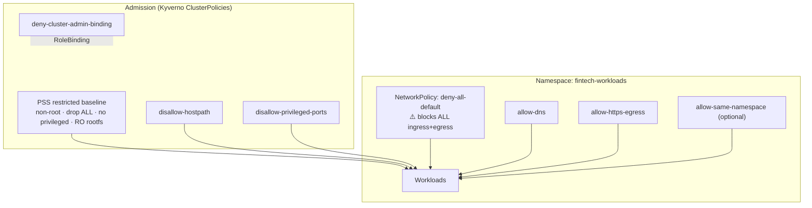

# k8s-fintech-baseline

[](https://github.com/ranas-mukminov/k8s-fintech-baseline/actions/workflows/ci.yml)
[](LICENSE)
[](https://run-as-daemon.dev)

**PCI/FinTech-oriented Kubernetes security baseline** — example Kyverno Pod Security Standards (PSS) policies, default-deny NetworkPolicies, RBAC guardrails, and a kustomize pack.

> **EXAMPLES only — not certified PCI compliance.** These manifests illustrate common hardening patterns. They do **not** constitute legal advice, a compliance audit, or a claim that your environment meets PCI-DSS (or any other standard). Adapt, review, and validate with your security/compliance team.

---

## The problem

FinTech and payment workloads on Kubernetes often start with:

- Privileged or root containers by default
- Wide-open pod-to-pod networking
- Ad-hoc NetworkPolicies that never cover DNS, monitoring, or ingress
- Standing `cluster-admin` bindings
- “We’ll add PSS later” — until an auditor asks

This repo gives you a **small, opinionated starter pack** so platform and AppSec teams can enforce restricted-ish PSS via Kyverno and apply cautious default-deny networking — without pretending one YAML file equals certification.

## Who it’s for

- Platform / SRE teams running payment or cardholder-data adjacent workloads
- DevSecOps engineers introducing Kyverno + NetworkPolicy in regulated environments
- FinTech startups that need a **baseline**, not a 200-page binder

## Architecture



## What’s included

| Path | Purpose |
|------|---------|
| [`policies/pss/restricted-baseline.yaml`](policies/pss/restricted-baseline.yaml) | Kyverno: non-root, drop ALL caps, no privileged, RO rootfs |
| [`policies/pss/require-ro-rootfs.yaml`](policies/pss/require-ro-rootfs.yaml) | Standalone RO rootfs (optional; also in restricted-baseline) |
| [`policies/pss/disallow-hostpath.yaml`](policies/pss/disallow-hostpath.yaml) | Kyverno: no hostPath volumes |
| [`policies/pss/disallow-privileged-ports.yaml`](policies/pss/disallow-privileged-ports.yaml) | Kyverno: containerPort ≥ 1024 |
| [`policies/rbac/deny-cluster-admin-binding.yaml`](policies/rbac/deny-cluster-admin-binding.yaml) | Kyverno: deny bindings to `cluster-admin` |
| [`policies/network/deny-all-default.yaml`](policies/network/deny-all-default.yaml) | **WARNING** default-deny ingress **and** egress |
| [`policies/network/allow-dns.yaml`](policies/network/allow-dns.yaml) | Allow DNS egress (UDP/TCP 53) |
| [`policies/network/allow-https-egress.yaml`](policies/network/allow-https-egress.yaml) | Allow HTTPS egress (TCP 443) — narrow in prod |
| [`policies/network/allow-same-namespace.yaml`](policies/network/allow-same-namespace.yaml) | Optional same-namespace ingress+egress |
| [`examples/namespace.yaml`](examples/namespace.yaml) | Sample `Namespace` with PSS labels |
| [`kustomization.yaml`](kustomization.yaml) | Apply namespace + policies in order |
| [`overlays/fintech-baseline/`](overlays/fintech-baseline/) | Stricter overlay (no same-ns allow) |
| [`scripts/validate.sh`](scripts/validate.sh) | Local YAML / kustomize / kyverno test helper |
| [`kyverno-tests/`](kyverno-tests/) | Kyverno CLI unit tests (no cluster) |

All policies are clearly marked as **EXAMPLES**. Apply carefully in non-prod first.

## Apply order

```bash
# 1. Install Kyverno (example — pin a version you trust)
helm repo add kyverno https://kyverno.github.io/helm-charts
helm repo update
helm install kyverno kyverno/kyverno -n kyverno --create-namespace

# 2. Preview with kustomize (no apply)
kubectl kustomize .
# or: kubectl kustomize overlays/fintech-baseline --load-restrictor=LoadRestrictionsNone

# 3. Apply (NON-PROD FIRST)
# WARNING: includes default-deny NetworkPolicy — will break traffic until allows exist
kubectl apply -k .

# Manual order if not using kustomize:
kubectl apply -f examples/namespace.yaml
kubectl apply -f policies/pss/
kubectl apply -f policies/rbac/
kubectl apply -f policies/network/deny-all-default.yaml   # ⚠️ carefully
kubectl apply -f policies/network/allow-dns.yaml
kubectl apply -f policies/network/allow-https-egress.yaml
kubectl apply -f policies/network/allow-same-namespace.yaml  # optional
```

### ⚠️ WARNING — default-deny

`deny-all-default.yaml` selects **all pods** in `fintech-workloads` and denies **all** ingress and egress until you add allow rules. Always:

1. Stage in a dedicated non-prod namespace
2. Apply DNS (and any required allows) immediately after
3. Verify workloads before promoting to production

## Validate locally / CI

```bash
# YAML parse + kustomize + kyverno test (if CLIs installed)
./scripts/validate.sh

# Kyverno unit tests only (no cluster)
kyverno test kyverno-tests/
```

CI runs on every push/PR to `main` (YAML parse, kustomize build, Kyverno CLI tests).

## High-level map to PCI-DSS themes

| Theme (illustrative) | How this repo helps (examples) |
|----------------------|--------------------------------|
| Restrict access / least privilege | Non-root, no privileged, drop capabilities, deny cluster-admin bindings |
| Segment cardholder / sensitive environments | Namespace isolation + default-deny NetworkPolicies |
| Harden systems | PSS-style admission controls via Kyverno |
| Document & control change | Git-managed policies as code + CI |

This mapping is **educational and incomplete**. It is **not** a PCI-DSS control matrix and **not** legal or QSA advice.

## Related projects

- [AutoHarden-Toolkit](https://github.com/ranas-mukminov/AutoHarden-Toolkit) — CIS-oriented server hardening
- [run-as-daemon.dev](https://run-as-daemon.dev) · [run-as-daemon.ru](https://run-as-daemon.ru) — author site

## Security

See [`SECURITY.md`](SECURITY.md) for reporting issues. Do not open public issues for exploitable cluster misconfigurations that expose production CDE.

## Changelog

See [`CHANGELOG.md`](CHANGELOG.md).

## Project & contact

- Site: [run-as-daemon.dev](https://run-as-daemon.dev) · [run-as-daemon.ru](https://run-as-daemon.ru)
- Author: [ranas-mukminov](https://github.com/ranas-mukminov) (Run_as_daemon / Ranas Security)

## License

MIT — see [`LICENSE`](LICENSE). Copyright © 2026 Run_as_daemon / ranas-mukminov.

## Contributing

See [`CONTRIBUTING.md`](CONTRIBUTING.md). PRs that keep examples safe, labeled, and non-claiming “certified” are welcome.

---

### If this helped — star the repo

Stars help others find a practical FinTech K8s baseline. If you fork or adapt it, a star is appreciated.

---

## Кратко (RU)

Базовый набор **примеров** политик для Kubernetes в FinTech/PCI-контексте: Kyverno (PSS + RBAC) + NetworkPolicy (default-deny + DNS/HTTPS). Это **не** сертифицированный PCI-комплаенс и не юридическая консультация. Сайт: [run-as-daemon.ru](https://run-as-daemon.ru) · [run-as-daemon.dev](https://run-as-daemon.dev).
