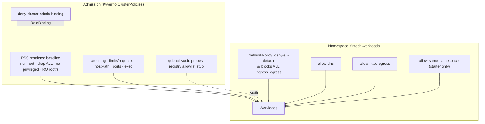

# k8s-fintech-baseline

[](https://github.com/ranas-mukminov/k8s-fintech-baseline/actions/workflows/ci.yml)
[](LICENSE)
[](https://github.com/ranas-mukminov/k8s-fintech-baseline/releases)
[](https://run-as-daemon.dev)

**PCI/FinTech-oriented Kubernetes security baseline** — example Kyverno Pod Security Standards (PSS) policies, default-deny NetworkPolicies, RBAC guardrails, and kustomize overlays (`starter` / `strict`).

> **EXAMPLES only — not certified PCI compliance.** These manifests illustrate common hardening patterns. They do **not** constitute legal advice, a compliance audit, or a claim that your environment meets PCI-DSS (or any other standard). Adapt, review, and validate with your security/compliance team.

---

## Demo (asciinema-style walkthrough)

**60s proof:** `make validate` prints per-policy OK lines and `RESULT: OK` (Kyverno unit tests, no cluster) in about a minute on a laptop.


```text
$ git clone https://github.com/ranas-mukminov/k8s-fintech-baseline.git && cd k8s-fintech-baseline
$ make validate
==> k8s-fintech-baseline validate
  OK  policies/pss/disallow-latest-tag.yaml
  ...
  OK  kyverno test
RESULT: OK

$ make kustomize-strict
Wrote /tmp/k8s-fintech-strict.yaml

$ kubectl apply -k overlays/starter --load-restrictor=LoadRestrictionsNone
# WARNING: default-deny in namespace fintech-workloads — non-prod only
namespace/fintech-workloads created
clusterpolicy.kyverno.io/pss-restricted-baseline-example created
clusterpolicy.kyverno.io/disallow-latest-tag-example created
...
networkpolicy.networking.k8s.io/deny-all-default-example created
networkpolicy.networking.k8s.io/allow-dns-example created

$ kubectl get clusterpolicy
NAME                                  BACKGROUND   ACTION
pss-restricted-baseline-example       true         Enforce
disallow-latest-tag-example           true         Enforce
require-resource-limits-example       true         Enforce
disallow-exec-example                 false        Enforce
require-probes-example                true         Audit
image-registry-allowlist-example      true         Audit
...
```

Full non-prod path: [`docs/QUICKSTART.md`](docs/QUICKSTART.md).

---

## The problem

FinTech and payment workloads on Kubernetes often start with:

- Privileged or root containers by default
- Wide-open pod-to-pod networking
- Ad-hoc NetworkPolicies that never cover DNS, monitoring, or ingress
- Standing `cluster-admin` bindings
- Untagged / `:latest` images and missing resource limits
- “We’ll add PSS later” — until an auditor asks

This repo gives you a **small, opinionated starter pack** so platform and AppSec teams can enforce restricted-ish PSS via Kyverno and apply cautious default-deny networking — without pretending one YAML file equals certification.

## Who it’s for

- Platform / SRE teams running payment or cardholder-data adjacent workloads
- DevSecOps engineers introducing Kyverno + NetworkPolicy in regulated environments
- FinTech startups that need a **baseline**, not a 200-page binder

## Comparison — where this fits

| Project | What it does | How this repo differs |
|---------|--------------|------------------------|
| [kube-bench](https://github.com/aquasecurity/kube-bench) | CIS Kubernetes benchmark checks on **nodes/control plane** | We ship **workload admission + NetworkPolicy examples**, not node CIS scans. Use both. |
| [Kyverno](https://kyverno.io/) / [kyverno/policies](https://github.com/kyverno/policies) | Policy engine + large community policy library | We curate a **FinTech-oriented subset** with default-deny NetPols, starter/strict overlays, CI tests, and explicit non-certification docs. |
| Upstream PSS / Pod Security Admission | Built-in restricted/baseline labels | We add Kyverno extras (latest tag, limits, exec deny, registry stub) and network/RBAC examples around a labeled namespace. |

**Use together:** kube-bench (cluster CIS) + this baseline (workload policies) + your image scanner/signer.

## Architecture



## What’s included

| Path | Purpose |
|------|---------|
| [`policies/pss/`](policies/pss/) | Kyverno PSS + best-practice examples (incl. latest-tag, limits/requests, exec, probes Audit, registry stub) |
| [`policies/rbac/`](policies/rbac/) | Deny `cluster-admin` bindings |
| [`policies/network/`](policies/network/) | Default-deny + DNS/HTTPS (+ optional same-ns) |
| [`base/`](base/) | Shared kustomize base |
| [`overlays/starter`](overlays/starter/) | Base + same-namespace allow |
| [`overlays/strict`](overlays/strict/) | Base only (stronger isolation) |
| [`docs/QUICKSTART.md`](docs/QUICKSTART.md) | 10-minute non-prod path |
| [`docs/PCI-MAPPING.md`](docs/PCI-MAPPING.md) | High-level PCI **themes** only (not certification) |
| [`Makefile`](Makefile) | `validate` / `test` / `docs` / kustomize helpers |
| [`kyverno-tests/`](kyverno-tests/) | Kyverno CLI unit tests (no cluster) |
| [`scripts/validate.sh`](scripts/validate.sh) | Local YAML / kustomize / kyverno helper |

All policies are clearly marked as **EXAMPLES**. Apply carefully in non-prod first.

## Apply order

```bash
# 1. Install Kyverno (example — pin a version you trust)
helm repo add kyverno https://kyverno.github.io/helm-charts
helm repo update
helm install kyverno kyverno/kyverno -n kyverno --create-namespace

# 2. Preview
make kustomize-starter   # or: make kustomize-strict
# kubectl kustomize overlays/starter --load-restrictor=LoadRestrictionsNone

# 3. Apply (NON-PROD FIRST)
# WARNING: includes default-deny NetworkPolicy — will break traffic until allows exist
kubectl apply -k overlays/starter --load-restrictor=LoadRestrictionsNone
```

See [`docs/QUICKSTART.md`](docs/QUICKSTART.md) for customize / undo steps.

### ⚠️ WARNING — default-deny

`deny-all-default.yaml` selects **all pods** in `fintech-workloads` and denies **all** ingress and egress until you add allow rules. Always:

1. Stage in a dedicated non-prod namespace
2. Apply DNS (and any required allows) immediately after
3. Verify workloads before promoting to production

## Validate locally / CI

```bash
make validate          # YAML + kustomize + kyverno tests
make test              # kyverno test kyverno-tests/
make docs              # doc entry points
```

CI runs on every push/PR to `main`.

## High-level map to PCI-DSS themes

See [`docs/PCI-MAPPING.md`](docs/PCI-MAPPING.md) for the educational theme table.

This mapping is **incomplete**. It is **not** a PCI-DSS control matrix and **not** legal or QSA advice. **No certification claims.**

## Related projects

- [ssh-harden](https://github.com/ranas-mukminov/ssh-harden) — minimal SSH daemon hardening helper (CIS-oriented examples)
- [AutoHarden-Toolkit](https://github.com/ranas-mukminov/AutoHarden-Toolkit) — broader CIS-oriented server hardening
- [run-as-daemon.dev](https://run-as-daemon.dev) · [run-as-daemon.ru](https://run-as-daemon.ru) — author site

## Security

See [`SECURITY.md`](SECURITY.md) for reporting issues. Do not open public issues for exploitable cluster misconfigurations that expose production CDE.

## Changelog

See [`CHANGELOG.md`](CHANGELOG.md).

## Project & contact

- Site: [run-as-daemon.dev](https://run-as-daemon.dev) · [run-as-daemon.ru](https://run-as-daemon.ru)
- Author: [ranas-mukminov](https://github.com/ranas-mukminov) (Run_as_daemon / Ranas Security)

## License

MIT — see [`LICENSE`](LICENSE). Copyright © 2026 Run_as_daemon / ranas-mukminov.

## Contributing

See [`CONTRIBUTING.md`](CONTRIBUTING.md). PRs that keep examples safe, labeled, and non-claiming “certified” are welcome.

---

### If this helped — star the repo

If this baseline saved you an afternoon of assembling Kyverno + NetworkPolicy from scratch, **please star it** — it helps other FinTech / platform engineers find a practical starting point.

[⭐ Star ranas-mukminov/k8s-fintech-baseline](https://github.com/ranas-mukminov/k8s-fintech-baseline)

Also useful at the host layer: [⭐ ssh-harden](https://github.com/ranas-mukminov/ssh-harden).

---

## Кратко (RU)

Базовый набор **примеров** политик для Kubernetes в FinTech/PCI-контексте: Kyverno (PSS + RBAC + best practices) + NetworkPolicy (default-deny + DNS/HTTPS), оверлеи `starter` / `strict`. Это **не** сертифицированный PCI-комплаенс и не юридическая консультация. Сайт: [run-as-daemon.ru](https://run-as-daemon.ru) · [run-as-daemon.dev](https://run-as-daemon.dev).
